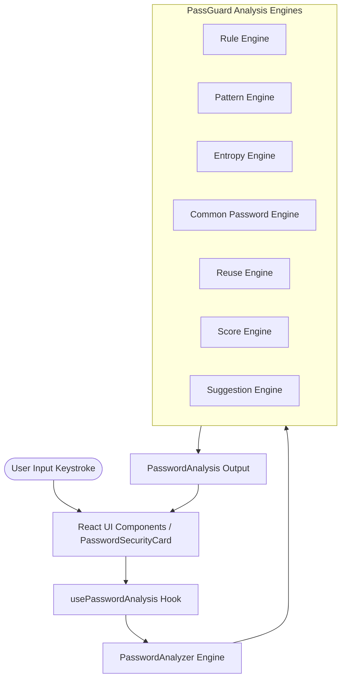

# PassGuard

> **Real-time password security guidance for React.**

[](https://github.com/vathsa1820/PassGuard/actions/workflows/ci.yml)


PassGuard is an open-source React component library and security engine designed to provide zero-knowledge, real-time password feedback. It evaluates password strength, detects weak patterns, calculates entropy, checks common breach dictionaries, and flags password reuse directly within browser memory.

---

## Table of Contents

- [Overview](#overview)
- [Why PassGuard](#why-passguard)
- [Features](#features)
- [Live Demo](#live-demo)
- [Installation](#installation)
- [Basic Usage](#basic-usage)
- [Configuration](#configuration)
- [Public Components](#public-components)
- [Architecture](#architecture)
- [Security & Privacy](#security--privacy)
- [Accessibility](#accessibility)
- [Browser Support](#browser-support)
- [Development](#development)
- [Project Structure](#project-structure)
- [Testing](#testing)
- [Contributing](#contributing)
- [Security Reporting](#security-reporting)
- [Roadmap](#roadmap)
- [License](#license)
- [Disclaimer](#disclaimer)

---

## Overview

PassGuard is an open-source React password security component library engineered for modern web applications. It provides real-time, interactive security feedback as users enter passwords during account registration, password resets, or credentials updates.

Designed for frontend engineers and security teams, PassGuard shifts password strength evaluation from opaque post-submit validation errors to immediate, user-friendly, in-flight guidance. By calculating entropy, enforcing custom policy rules, detecting structural patterns, and warning against password reuse, PassGuard helps users create resilient credentials without compromising user experience.

PassGuard is built on strict **zero-knowledge** principles. All analysis routines execute 100% locally within client browser memory. Plaintext passwords never leave the browser, are never logged to console or storage, and are never transmitted over network protocols.

Decoupled into modular analysis sub-engines, reactive React hooks, and accessible UI components, PassGuard can be dropped into existing forms using pre-styled components or integrated headlessly via custom hooks.

---

## Why PassGuard

Traditional password validation often relies on post-submission checks that present generic error messages such as `"Password does not meet security requirements"`. This approach creates friction and frequently prompts users to add trivial character variations that fail to improve cryptographic resilience.

PassGuard addresses this by providing:

- **Real-Time Visual Feedback**: Instant evaluation updated on every single keystroke.
- **Normalized Health Score (0–100)**: Transparent metric combining length, character diversity, structural complexity, and pattern deductions.
- **Requirement Checklist**: Live pass/fail status for organization-defined policy rules.
- **Structural Pattern Detection**: Identifies repeated characters, sequential ranges, and keyboard spatial sequences.
- **Information Entropy Estimation**: Measures password unpredictability in bits of entropy.
- **Common Password Detection**: Checks input against top compromised passwords in local memory.
- **Password Reuse Guidance**: Flags reuse against local session password history via cryptographic SHA-256 hashing.
- **Actionable Suggestions**: Specific instructions guiding users on how to strengthen credentials.
- **Configurable Policies**: TypeScript-typed configuration objects enforcing custom enterprise security standards.

---

## Features

| Feature | Description |
| :--- | :--- |
| **Real-Time Keystroke Analysis** | Evaluates password input instantly as the user types without latency. |
| **Password Health Score** | Produces a normalized `0–100` score and status label (`Weak`, `Fair`, `Strong`, `Excellent`). |
| **Configurable Policies** | Allows developers to define custom length, casing, numeric, symbol, and pattern rules. |
| **Pattern Recognition** | Flags repeated characters (`aaaa`), sequential ranges (`123`, `abc`), and keyboard rows (`qwerty`). |
| **Entropy Analysis** | Estimates unpredictability in bits based on character pool density and length. |
| **Common Password Check** | Compares input against a dictionary of top compromised passwords in local memory. |
| **Local Reuse Detection** | Checks SHA-256 hashes against session password history (subject to client storage scope). |
| **Smart Suggestions** | Generates prioritized, actionable advice to help users improve password strength. |
| **Zero-Knowledge Guarantee** | Executes 100% in browser memory with zero network transmission. |
| **Accessibility (WCAG 2.2 AA)** | Full keyboard navigation, ARIA live region support, and reduced-motion compliance. |

---

## Live Demo

Live demo coming soon.

To explore the interactive demo playground locally, clone the repository and run:

```bash
npm install
npm run dev
```

---

## Installation

Install the `@vatza/passguard` package via npm, pnpm, or yarn:

```bash
npm install @vatza/passguard
```

Import the library stylesheet in your application entrypoint (e.g., `App.tsx` or `main.tsx`):

```tsx
import '@vatza/passguard/style.css';
```

---

## Basic Usage

Render the primary `<PasswordSecurityCard />` component as a controlled or uncontrolled input:

```tsx
import React, { useState } from 'react';
import { PasswordSecurityCard } from '@vatza/passguard';
import '@vatza/passguard/style.css';

export function SignupForm() {
  const [password, setPassword] = useState('');

  return (
    <div style={{ maxWidth: '480px', margin: '2rem auto' }}>
      <PasswordSecurityCard
        value={password}
        onChange={(val) => setPassword(val)}
        onContinue={(analysis) => {
          console.log('Password verified with score:', analysis?.score);
        }}
      />
    </div>
  );
}
```

---

## Configuration

PassGuard allows customization of password validation criteria using the `PasswordPolicy` interface.

### Custom Policy Example

```tsx
import React, { useState } from 'react';
import { PasswordSecurityCard, type PasswordPolicy } from '@vatza/passguard';

const enterprisePolicy: PasswordPolicy = {
  minLength: 14,
  maxLength: 128,
  requireUppercase: true,
  requireLowercase: true,
  requireNumber: true,
  requireSymbol: true,
  preventRepeatedCharacters: true,
  preventSequentialPatterns: true,
  preventKeyboardPatterns: true,
  checkCommonPasswords: true,
  preventReuse: true,
};

export function EnterpriseSignup() {
  const [password, setPassword] = useState('');

  return (
    <PasswordSecurityCard
      policy={enterprisePolicy}
      value={password}
      onChange={setPassword}
    />
  );
}
```

### Policy Options Reference

| Option | Type | Default | Description |
| :--- | :--- | :--- | :--- |
| `minLength` | `number` | `12` | Minimum character length required (must be >= 1). |
| `maxLength` | `number` | `128` | Maximum character length allowed (must be >= minLength). |
| `requireUppercase` | `boolean` | `true` | Requires at least one uppercase letter (`A-Z`). |
| `requireLowercase` | `boolean` | `true` | Requires at least one lowercase letter (`a-z`). |
| `requireNumber` | `boolean` | `true` | Requires at least one numeric digit (`0-9`). |
| `requireSymbol` | `boolean` | `true` | Requires at least one special symbol (`!@#$%^&*`). |
| `preventRepeatedCharacters` | `boolean` | `true` | Flags 4+ consecutive identical characters (e.g., `aaaa`). |
| `preventSequentialPatterns` | `boolean` | `true` | Flags sequential character runs (e.g., `1234`, `abcd`). |
| `preventKeyboardPatterns` | `boolean` | `true` | Flags adjacent keyboard spatial rows (e.g., `qwerty`, `asdf`). |
| `checkCommonPasswords` | `boolean` | `true` | Compares input against local dictionary of common passwords. |
| `preventReuse` | `boolean` | `true` | Enables local session password reuse checking. |

---

## Public Components

The `@vatza/passguard` package exports the following public React UI components, hooks, and utilities:

### UI Components

- **`PasswordSecurityCard`**: Primary integrated container combining input, score indicator, requirement checklist, suggestion card, and reuse warnings.
- **`PasswordInput`**: Accessible password input field featuring a visibility toggle button, clear input state, and `autoComplete="new-password"` defaults.
- **`PasswordHealthScore`**: Progress indicator displaying a normalized numerical score (`0–100`) and strength status badge (`Weak`, `Fair`, `Strong`, `Excellent`).
- **`PasswordStrengthIndicator`**: Segmented strength meter visualizing relative security tiers.
- **`RequirementChecklist`**: Dynamic checklist indicating live pass/fail states for active policy constraints.
- **`SuggestionCard`**: Contextual guidance card displaying actionable advice to improve password entropy.
- **`ReuseWarning`**: Alert banner warning users if an entered password matches a previously recorded session hash.

### Hooks & Utilities

- **`usePasswordAnalysis(password, policy)`**: Reactive hook returning real-time `PasswordAnalysis` output.
- **`usePasswordAnalyzer(options)`**: Hook providing state management for controlled password analysis forms.
- **`usePasswordStrength(password)`**: Light hook returning normalized strength scores.
- **`analyzePassword(password, policy)`**: Asynchronous analysis function for headless programmatic evaluation.
- **`resolvePasswordPolicy(customPolicy)`**: Merges custom options with `defaultPasswordPolicy` and validates bounds.

---

## Architecture

PassGuard decouples its core security evaluation engines from the React rendering layer:



### Analysis Engine Separation

1. **Rule Engine**: Evaluates minimum/maximum length, character set requirements, and boolean policy rules.
2. **Pattern Engine**: Scans for 3+ character spatial keyboard paths, sequential runs, and repeated character blocks.
3. **Entropy Engine**: Calculates pool size $R$ and log-entropy $E = L \times \log_2(R)$ with character density weighting.
4. **Common Password Engine**: Performs constant-time lookup against common dictionary targets in local memory.
5. **Reuse Engine**: Computes SHA-256 hashes via browser WebCrypto API and compares against local session history.
6. **Score Engine**: Calculates a normalized `0–100` score using weighted factors and pattern deductions.
7. **Suggestion Engine**: Identifies failed criteria and prioritizes actionable remediation advice.

---

## Security & Privacy

- **Local Memory Processing**: All evaluation logic executes entirely within client browser memory.
- **Zero Network Exposure**: PassGuard makes no HTTP requests (`fetch`, `XMLHttpRequest`, `axios`, or WebSocket connections) and transmits no data to remote servers.
- **Zero Plaintext Storage**: Plaintext passwords are never logged to `console`, saved in `localStorage`/`sessionStorage`, or stored in cookies.
- **Local Reuse Detection Scope**: Password reuse checks rely on client-side SHA-256 hashes stored in browser memory or optional session storage. This feature provides interactive client-side feedback and is bounded by client storage isolation.
- **Frontend Guidance Boundary**: PassGuard is a **frontend security guidance library**, not an authentication service or backend password storage engine.

For detailed security analyses, threat boundaries, and audit findings, see:
- [docs/SECURITY.md](docs/SECURITY.md)
- [docs/THREAT-MODEL.md](docs/THREAT-MODEL.md)
- [docs/SECURITY-AUDIT.md](docs/SECURITY-AUDIT.md)

---

## Accessibility

PassGuard complies with **WCAG 2.2 AA** accessibility standards:

- **Keyboard Navigation**: Full focus visibility and keyboard controls (Tab navigation, Space/Enter toggle for visibility controls).
- **ARIA Semantics**: Programmatic binding via `aria-label`, `aria-describedby`, and `aria-live="polite"` regions for dynamic status updates.
- **Color Contrast**: All visual status indicators maintain a minimum 4.5:1 contrast ratio against light and dark backgrounds.
- **Motion Reduction**: Micro-animations respect user `prefers-reduced-motion` CSS media queries.

For complete accessibility audit reports, see [docs/ACCESSIBILITY.md](docs/ACCESSIBILITY.md).

---

## Browser Support

PassGuard supports all modern ECMAScript 2020+ environments with Web Crypto API (`window.crypto.subtle`) support:

- **Google Chrome / Microsoft Edge**: 80+
- **Mozilla Firefox**: 78+
- **Apple Safari**: 14+ (iOS & macOS)
- **Node.js**: 18+ (for SSR and test runners)

For detailed compatibility matrices, see [docs/BROWSER-SUPPORT.md](docs/BROWSER-SUPPORT.md).

---

## Development

### Prerequisites

- **Node.js**: v18.0.0 or higher
- **npm**: v9.0.0 or higher

### Local Setup & Commands

Clone the repository and install dependencies:

```bash
# Clone repository
git clone https://github.com/vathsa1820/PassGuard.git
cd PassGuard

# Install workspace dependencies
npm install

# Start local development playground
npm run dev

# Run full Vitest suite (240 unit & component tests)
npm run test

# Run tests in watch mode
npm run test:watch

# Generate test coverage report
npm run test:coverage

# Perform TypeScript type checking
npm run lint

# Build client library package
npm run build

# Perform dry-run package tarball inspection
npm run package
```

---

## Project Structure

```
PassGuard/
├── client/                       # Core library source (@vatza/passguard)
│   ├── src/
│   │   ├── components/           # React UI components
│   │   ├── config/               # Policy configuration & schemas
│   │   ├── engine/               # 7 security analysis sub-engines
│   │   ├── hooks/                # Public React hooks
│   │   ├── pages/                # Interactive local demo playground
│   │   ├── types/                # TypeScript interface declarations
│   │   └── index.ts              # Public API entrypoint
│   └── tests/                    # Vitest & Playwright test suites
├── docs/                         # Specifications, security audits, and QA reports
├── examples/                     # React, Next.js, and HTML integration examples
├── CHANGELOG.md                  # Release version history
├── CONTRIBUTING.md               # Contribution guidelines
├── LICENSE                       # MIT License
├── package.json                  # Root monorepo workspace configuration
└── README.md                     # Repository documentation
```

---

## Testing

PassGuard maintains a 100% test pass rate across 265 automated test scenarios:

- **Engine Unit Tests** (118 tests): Validates entropy formulas, pattern matching, rule checking, scoring math, and suggestion priorities.
- **React Component Tests** (35 tests): Verifies component rendering, state transitions, and user events.
- **Integration Flow Tests** (23 tests): Validates full form workflows, policy overrides, and callback triggers.
- **Edge-Case & Robustness Tests** (43 tests): Evaluates extreme input lengths (100k+ chars), unicode/emoji input, symbol injection, and invalid policies.
- **Automated Accessibility Tests** (7 tests): `jest-axe` audit verifying zero WCAG violations.
- **Performance Benchmarks** (6 tests): Ensures sub-millisecond execution times (< 1ms for standard inputs).
- **Security Invariant Tests** (8 tests): Enforces zero network calls and zero console logging invariants.
- **Cross-Browser E2E Tests** (25 tests): Playwright tests across Chromium, Firefox, WebKit, Mobile Chrome, and Mobile Safari.

---

## Contributing

Contributions are welcome! Please review [CONTRIBUTING.md](CONTRIBUTING.md) for details on code style, branch naming, and pull request procedures.

---

## Security Reporting

If you discover a potential security vulnerability in PassGuard, please follow responsible disclosure guidelines. Refer to [docs/SECURITY.md](docs/SECURITY.md) or report security concerns privately via GitHub Security Advisories. Do not open public issues for undisclosed security vulnerabilities.

---

## Roadmap

### Completed (v1.0.0)
- [x] Zero-knowledge client-side password analysis engine.
- [x] 7 integrated sub-engines (Rules, Score, Entropy, Patterns, Common Passwords, Reuse, Suggestions).
- [x] Pre-styled React components (`PasswordSecurityCard`, `PasswordInput`, `PasswordHealthScore`, etc.).
- [x] WCAG 2.2 AA accessibility and cross-browser Playwright test matrix.

### Planned (v1.1.0)
- [ ] React 19 Server Components compatibility verification.
- [ ] Customizable theme tokens for seamless TailwindCSS and CSS variable overrides.

### Possible Future Exploration
- [ ] Optional server-side k-Anonymity breach lookup integrations (e.g., HaveIBeenPwned API prefix matching).

---

## License

This project is licensed under the **MIT License**. See the [LICENSE](LICENSE) file for details.

---

## Disclaimer

PassGuard provides client-side password security guidance and real-time user feedback. It does not replace application backend security controls, server-side password hashing (e.g., `Argon2id`, `bcrypt`), multi-factor authentication (MFA), rate limiting, session management, or transport-layer security (HTTPS).
